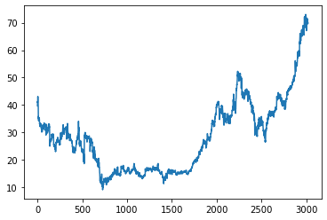
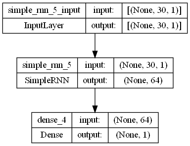
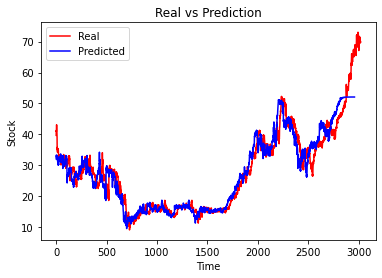

# DJIA 30 Stock Prediction using Simple RNN
[Dataset on kaggle](https://www.kaggle.com/datasets/szrlee/stock-time-series-20050101-to-20171231)

## Contents
### Data Understanding
Dataset contains 3019 rows and 7 columns. It's a time series data and each row is a unique date.

We choose "Open" column for prediction

### Data Preprocessing
In this part we divide the data into train and test and then create sequences of data.

### Modeling

### Evaluation

